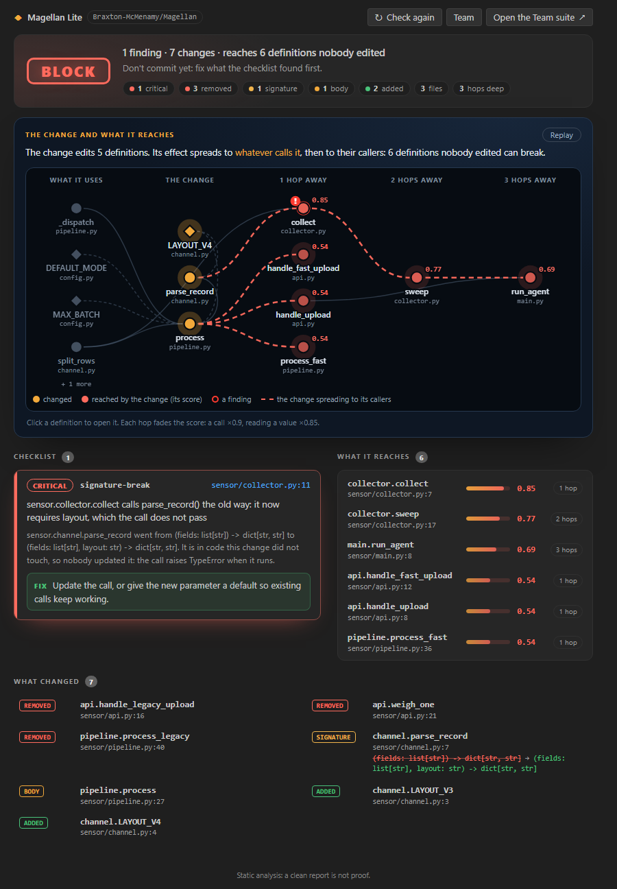
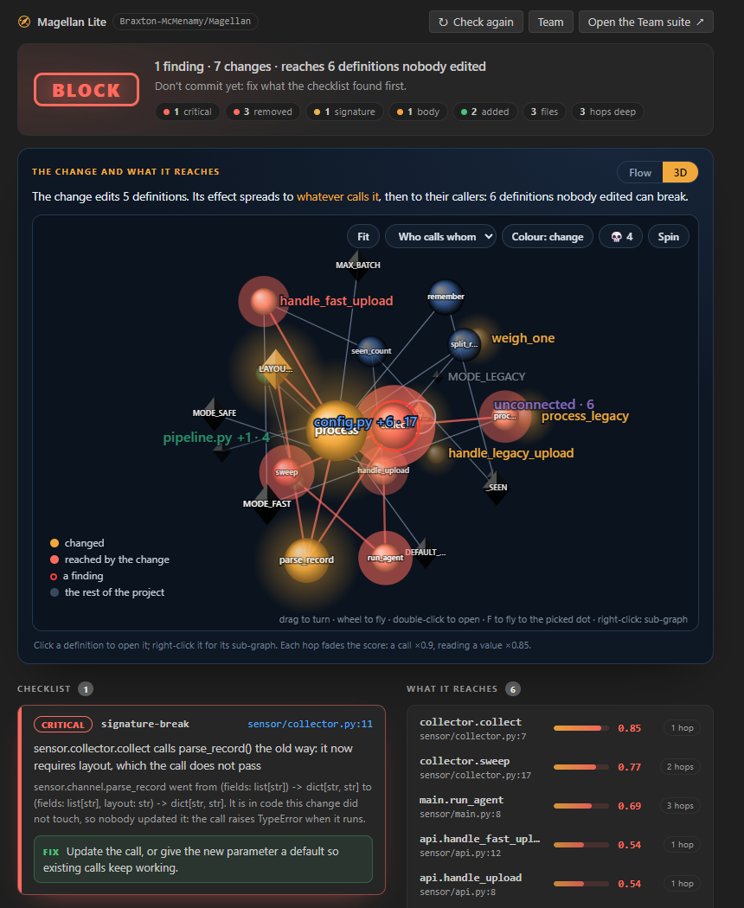

<p align="center">
  
</p>

<h1 align="center">Magellan Lite</h1>

<p align="center"><b>Know what your change breaks before you commit it, even in the files you never opened.</b></p>

<p align="center">
  <a href="https://github.com/Braxton-McMenamy/Magellan"></a>
  
  
  
</p>

<p align="center">
  <a href="#quick-start">Quick start</a> ·
  <a href="#features">Features</a> ·
  <a href="#the-map">The map</a> ·
  <a href="#commands">Commands</a> ·
  <a href="#settings">Settings</a> ·
  <a href="https://magellan-code.pages.dev">Website</a> ·
  <a href="https://github.com/Braxton-McMenamy/Magellan">Repository</a>
</p>



Magellan Lite maps your code from its syntax trees, finds exactly what your change touched,
and follows it to every caller it can break. Then it runs a checklist built from real
software failures on what it found, and gives the change one verdict: `ok`, `review` or
`block`.

- **It looks past the file you are in.** The break above is in `collector.py`, a file the
  change never touched. Magellan Lite puts the squiggle there, and says which edit caused it.
- **It reads old code too:** Python 2 and 3, Java, C, Fortran and COBOL, and the calls
  between them (a C function behind a Java `native` method reaches its Java callers).
- **Nothing to set up.** The extension brings its own engine and finds a Python 3.10 or newer
  on your computer by itself. No `pip install`, no interpreter to pick, nothing uploaded.

## Quick start

1. **Install the extension**: download
   [magellan-lite-0.3.1.vsix](https://magellan-code.pages.dev/downloads/magellan-lite-0.3.1.vsix)
   from the website, then Extensions view → `...` → *Install from VSIX...* → pick it, or
   `code --install-extension magellan-lite-0.3.1.vsix`.
2. **Open a project and save a change.** The verdict appears in the status bar a moment later,
   and each finding on its line. That's all: there is nothing to configure.
3. **Open the map**: click the verdict, or run **Magellan Lite: Show the map**. Then click into
   any function in the editor: the map shows it and its neighbourhood.

*Help → Get Started → Get started with Magellan Lite* walks through the rest in four steps.

## Features

### Findings where the damage lands

Every save compares your working tree with the last commit. Broken call sites, deleted code
still in use, a loop that can never end, a regular expression that can take forever, a date
that only exists one year in four: each finding sits on its line with a squiggle, says
**why**, and says **how to fix it**. The checklist comes from real failures (Knight Capital,
CrowdStrike, Cloudflare, the Zune, Azure's leap day, Therac-25), and each rule stays quiet
when it is unsure.

The status bar keeps the verdict for the whole change; the **Magellan Lite** view in the
Activity Bar lists the **Checklist** and **What it reaches**, and counts what needs a person on
its icon. Files with findings get an Explorer badge.

### Your team, before anyone merges

Two changes can each be fine and break together: one adds a required parameter, the other a
new call the old way. **Share my work in progress** publishes your working tree for your
teammates (no commit, no branch); **Check against my team** shows only the problems your work
plus a teammate's has, on the line, saying whose work they come from.

The **Team** view shows this workspace's GitHub repository, found from its git remote, and
**Open the Team suite** opens the website's live view of everyone's work, already connected.
Turn on **Share On Save** and it follows your work as you save. Whoever can read the
repository can read what you share: on a public repository, everyone.

### Old code, ready to change

Python 2 is read through a line-for-line rewrite, so code waiting for its upgrade is on the
map. COBOL copybooks, Fortran `COMMON` blocks and C headers are checked for layout changes,
and every language's calls are followed into the others. Before changing an old function,
pick it in 3D and press **What depends on it** on the website's Scene: everything that would
feel the change, hop by hop.

## The map



**Magellan Lite: Show the map** opens the map beside your code, on its own: the verdict in a
line above it, the findings a click away.

- **Global:** the whole project in 3D, as clusters on a sphere, by **language**, **folder** or
  **who calls whom**. Functions are spheres, classes cubes, data diamonds. What changed
  glows orange, what it reaches is red by heat, a red ring marks a finding. Drag to turn,
  the wheel flies toward the cursor, **F** flies to the picked dot, **Home** shows everything,
  double-click opens.
- **Local:** click into a function or class in the editor, and the map shows it and its
  neighbourhood: what depends on it two hops back, and what it uses. One **Local** tab follows
  the cursor as you move through the code. **Global** goes back to the whole map (and stops
  following); **Local** follows again. The padlock, or **L**, locks the map: clicks in the code
  leave it alone until you unlock it. Opening code from the map never moves the map.
- **Flow:** a neighbourhood (Local, or a sub-graph) read left to right: what it uses, it, then
  everything that depends on it, one hop per column, with a score for how hard each one would
  be hit. Click a dot to open it. The whole map is 3D only: as a flow, a whole project is too
  big to read.
- **Findings:** the **Findings** button (with the count) opens every finding in a drawer beside
  the map, worst first, each with its fix; what the change reaches and what changed are folded
  below them. Click a dot with a red ring for its own findings, with a button that opens its
  code. **Escape** closes the drawer.
- **The skull** lights up code nothing in the project uses: definitions whose name appears
  nowhere else. Decorated definitions, overrides and tests are left out, since something
  finds them without naming them.
- **Sub-graphs:** right-click a dot (in either view) for **Show sub-graph**: it, what depends
  on it two hops back and what it uses, in a tab of its own above the map, with its own camera
  and both views. **Sub-graph of its file** does the same for everything in its file. The
  first tab is the whole map, then Local; **[** and **]** switch, × closes.

The same renderers draw the website's [Scene](https://magellan-code.pages.dev/scene.html) and
[Team suite](https://magellan-code.pages.dev/suite.html).

## Commands

| command | what it does |
|---|---|
| **Magellan Lite: Check this change** | check now (it also runs on every save) |
| **Magellan Lite: Show the map** | the map panel: the whole map in 3D, Local (follows the cursor; a lock), sub-graphs, Flow, the findings beside it |
| **Magellan Lite: Share my work in progress with my team** | publish your working tree to `refs/wip/<you>` |
| **Magellan Lite: Check against my team's work in progress** | what only your work plus a teammate's breaks |
| **Magellan Lite: Open the Team suite** | the website's live team view, connected to this repository |
| **Magellan Lite: Show output** | the log, for when something looks wrong |

## Settings

| setting | default | what it does |
|---|---|---|
| `magellanLite.checkOnSave` | on | check the change every time you save |
| `magellanLite.against` | `git:HEAD` | what to compare with: `git:REV`, or a folder holding the old version |
| `magellanLite.showLow` | on | show low-severity findings (`print()` left in, `== None`, ...); off hides them |
| `magellanLite.shareOnSave` | off | share your work in progress after you save (at most every 15 seconds) |
| `magellanLite.pythonPath` | empty | leave it empty; set it only to force one interpreter |

If you have the full Magellan extension installed too, disable one of them so the two don't
both mark the same files.

## Working on it

To build the `.vsix` from the repository:

```sh
cd editors/vscode && npm run package    # copies the engine in (bundle.js), makes the .vsix
```

To run it from the repository (the path must be a full one: with a relative path, VS Code on
Windows looks for `\editors\vscode` at the root of the drive):

```powershell
code --extensionDevelopmentPath="$PWD\editors\vscode" "$PWD"       # PowerShell, from the repo root
```

```sh
code --extensionDevelopmentPath="$(pwd)/editors/vscode" "$(pwd)"   # bash
```

Run that way, the extension uses the repository's own `magellan_lite/`, so engine changes show
up on the next save.

| file | what |
|---|---|
| `extension.js` | commands, check on save, the Problems panel, the status bar, the map panel |
| `follow.js` | which definition the cursor is in, and when to tell the map panel (Local) |
| `python.js` | finding a Python and the engine, so nobody configures either |
| `repo.js` | which GitHub repository this workspace is, from its git remote |
| `sidebar.js` | the sidebar's three views, the Activity Bar badge, the Explorer badges |
| `lite.js` | what to do with Magellan Lite's JSON (no VS Code in it, so plain Node tests it) |
| `panel.js`, `media/panel.*`, `media/findings.js` | the map panel's page; which findings are in which dot |
| `media/map.js`, `media/graph3d.js`, `media/scene3d.js`, `media/subgraph*.js`, `media/map.css` | the website's Flow and 3D renderers and its sub-graphs, copied by `sync.js` (edit `site/`, then `npm run sync`) |
| `media/walkthrough/` | the Get Started walkthrough's pages |
| `bundle.js` | copies `magellan_lite/` into `engine/` when packaging (not committed) |
| `test/` | `npm test`: the extension against a fake VS Code, a fake Python and a fake git |

### Tasks

Every task is a `TODO(<name>)` where the work goes, with numbered steps.

**Faidh**:

1. Done: the status bar turns red on block and yellow on review (`extension.js`).
2. Done: the `magellanLite.showLow` setting hides low-severity findings from the Problems panel,
   the Checklist and the Explorer badges (`lite.js`, `sidebar.js`).
3. Done: the icon in the Extensions view (`media/icon.png`, from `media/readme/logo.png`).
4. TODO(faidh) 4, here: once it runs for you, take a screenshot of a squiggle and the status bar
   (the CrowdStrike-class example in `demo/incidents/sensor-signature-break` makes a good one),
   save it as `media/readme/check.png`, and show it under the "Findings where the damage lands"
   heading above with ``.
